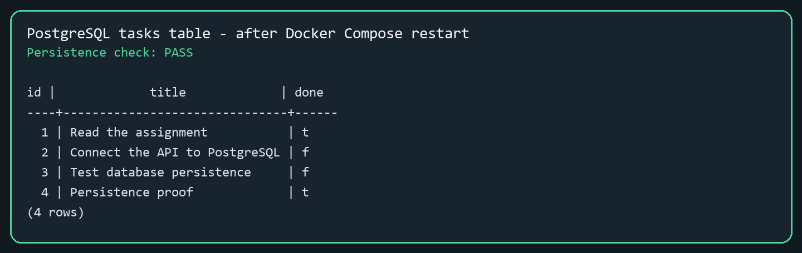

# Task API - PostgreSQL and Docker

This is my FlyRank Backend Track containerization assignment. I kept the same task CRUD API from the earlier assignments, replaced SQLite with PostgreSQL, and placed the API and database in one Docker Compose stack.

The complete stack starts with one command, and PostgreSQL stores its data in a named Docker volume so tasks survive a normal `docker compose down` and restart.

## What changed

The HTTP routes and response shapes stayed the same. The storage implementation changed:

- PostgreSQL now runs as a separate container.
- `psycopg` sends parameterized SQL to PostgreSQL.
- All database code is isolated in `app/repository.py`.
- The connection string comes from `DATABASE_URL`.
- Compose waits for PostgreSQL to become healthy before starting the API.
- A named volume called `taskdata` keeps the rows after containers stop.

This shows why storage is an implementation detail: an API client can use the same endpoints even when the database engine changes.

## Project structure

```text
Assignment 2/
|-- app/
|   |-- __init__.py
|   |-- main.py
|   `-- repository.py
|-- docs/
|   |-- api-evidence.txt
|   |-- database-content.png
|   |-- database-evidence.txt
|   |-- test-results.txt
|   `-- verification-summary.md
|-- tests/
|   |-- conftest.py
|   |-- test_api.py
|   |-- test_infrastructure.py
|   `-- test_repository.py
|-- .dockerignore
|-- .env.example
|-- .gitignore
|-- compose.yaml
|-- Dockerfile
|-- requirements.txt
|-- requirements-dev.txt
`-- README.md
```

## Run the complete stack

Docker Desktop or another Docker engine with Compose is required. PostgreSQL does not need to be installed separately.

First create the local environment file.

PowerShell:

```powershell
Copy-Item .env.example .env
```

macOS/Linux:

```bash
cp .env.example .env
```

Then build and start both services:

```bash
docker compose up --build
```

The API will be available at:

- API: `http://localhost:3000`
- Swagger UI: `http://localhost:3000/docs`
- Health check: `http://localhost:3000/health`

Stop the stack with:

```bash
docker compose down
```

Do not add `-v` when checking persistence because that flag intentionally deletes the database volume.

## Environment variables

The committed `.env.example` documents the required local values:

| Variable | Purpose |
| --- | --- |
| `POSTGRES_USER` | PostgreSQL user created by the official image |
| `POSTGRES_PASSWORD` | Local development password |
| `POSTGRES_DB` | Database created at first startup |
| `DATABASE_URL` | Full connection string used by the API |

The real `.env` file is ignored by Git. No connection string or password is stored in the Python source.

## Database initialization

When the API starts, it retries the database connection while PostgreSQL becomes ready. The same definition is available in [`docs/schema.sql`](docs/schema.sql) for quick review. It creates this table if it is missing:

```sql
CREATE TABLE IF NOT EXISTS tasks (
    id SERIAL PRIMARY KEY,
    title TEXT NOT NULL,
    done BOOLEAN NOT NULL DEFAULT FALSE
);
```

The API checks the row count before seeding. It inserts these examples only when the table is empty:

1. Read the assignment
2. Connect the API to PostgreSQL
3. Test database persistence

Restarting the application does not duplicate them.

## Endpoints

| Method | Path | Purpose | Success | Errors |
| --- | --- | --- | --- | --- |
| `GET` | `/tasks` | List every task | `200` | - |
| `GET` | `/tasks/{task_id}` | Get one task | `200` | `404` unknown ID |
| `POST` | `/tasks` | Create a task | `201` | `400` invalid body |
| `PUT` | `/tasks/{task_id}` | Update title and/or done | `200` | `400` invalid body, `404` unknown ID |
| `DELETE` | `/tasks/{task_id}` | Delete a task | `204` empty body | `404` unknown ID |

Every error is JSON, for example:

```json
{"error":"Task not found"}
```

## Request examples

The ready-to-run [`examples/requests.http`](examples/requests.http) collection covers
the health check and every CRUD route. It works with the VS Code REST Client and
JetBrains HTTP Client.

Create a task:

```bash
curl -i -X POST http://localhost:3000/tasks \
  -H "Content-Type: application/json" \
  -d '{"title":"Buy milk"}'
```

Expected response format:

```text
HTTP/1.1 201 Created
content-type: application/json

{"id":4,"title":"Buy milk","done":false}
```

I also captured a real `curl -i` response from the running Docker stack:

```text
HTTP/1.1 200 OK
content-type: application/json

[{"id":1,"title":"Read the assignment","done":true},{"id":2,"title":"Connect the API to PostgreSQL","done":false},{"id":3,"title":"Test database persistence","done":false}]
```

The complete live HTTP evidence is saved in [`docs/api-evidence.txt`](docs/api-evidence.txt).

Update it:

```bash
curl -i -X PUT http://localhost:3000/tasks/4 \
  -H "Content-Type: application/json" \
  -d '{"title":"Buy milk today","done":true}'
```

Delete it:

```bash
curl -i -X DELETE http://localhost:3000/tasks/4
```

The create and update queries use psycopg `%s` placeholders. The title and other request values are always passed separately from the SQL string, so SQL-looking input is stored as ordinary text.

## Health check

`GET /health` runs `SELECT 1` against PostgreSQL.

Healthy response:

```json
{"status":"ok","db":"ok"}
```

If the database is unavailable, it returns `503` with:

```json
{"status":"error","db":"unavailable"}
```

A load balancer can use this endpoint to stop sending traffic to an API instance that cannot reach its database.

## Test database rows

After the stack starts, inspect the real table and rows with:

```bash
docker compose exec db psql -U postgres -d tasks -c "\dt"
docker compose exec db psql -U postgres -d tasks -c "SELECT id, title, done FROM tasks ORDER BY id;"
```

The real `psql` output before and after the full-stack restart is saved in [`docs/database-evidence.txt`](docs/database-evidence.txt).



## Prove persistence

1. Create a task named `Persistence proof`.
2. Confirm it appears in `GET /tasks` and the PostgreSQL query above.
3. Run `docker compose down`.
4. Run `docker compose up -d`.
5. Request the same task again. It should still exist because `taskdata` was not removed.

## Run automated tests

Install the development dependencies:

```bash
python -m pip install -r requirements-dev.txt
```

Run the suite:

```bash
python -m pytest -q
```

The final local run completed with **34 passed**. The tests cover table initialization, seed protection, retry behavior, all CRUD routes, validation, status codes, JSON errors, SQL-like titles, database health, Compose structure, environment configuration, and volume configuration. The saved output is in `docs/test-results.txt`.

## Verification status

The complete stack was built and run with Docker Desktop. I verified the health check, the three first-run seed rows, the full create/update/delete cycle, required `400` and `404` errors, live PostgreSQL rows, and persistence across `docker compose down` followed by `docker compose up`. The final Compose status showed the API running and PostgreSQL healthy. Full details are recorded in [`docs/verification-summary.md`](docs/verification-summary.md).

## Author

Md. Tamjid Hossain  
FlyRank AI Internship - Backend Track, Week 3
