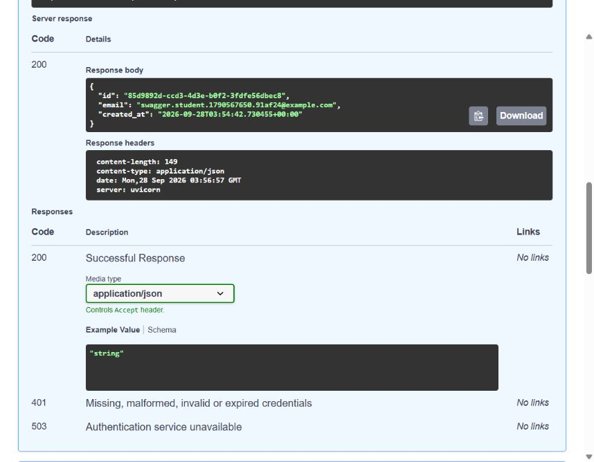

# Login & Protect API

Week 4, Assignment 1 | FlyRank Backend Track | Md. Tamjid Hossain

For this assignment, I extended my Week 3 FastAPI and PostgreSQL project with Supabase authentication. A user can sign up, log in, view protected information, and log out. I used one reusable FastAPI dependency to protect the profile, dashboard, and logout routes.

Supabase stores the accounts, hashes passwords, and creates the tokens. My API only sends credentials to Supabase and verifies the access token returned by it.

## Setup and run

Requirements: Docker Desktop with Docker Compose, and a free Supabase project. Python 3.12+ is needed only for local development or tests.

1. Copy `.env.example` to `.env` (`Copy-Item .env.example .env` in PowerShell).
2. Set `SUPABASE_URL` to your Supabase project URL and `SUPABASE_KEY` to its anon or publishable key. Never use a service-role or secret key.
3. In a practice project, turn off **Authentication > Sign In / Providers > Confirm email** for the immediate signup/login exercise. Otherwise, confirm the email before logging in. Keep confirmation enabled in a production project.
4. Set a local PostgreSQL password in both `POSTGRES_PASSWORD` and `DATABASE_URL`. The example `dev` password is for local practice only.
5. Run the complete stack with one command:

```sh
docker compose up --build
```

Open `http://localhost:3000/docs`. If port 3000 is already occupied, set `PORT=3001` in `.env`, then use `http://localhost:3001/docs`. The local verification run uses 3001 so the Week 3 server can keep running.

Compose creates the database and waits for it to become healthy before starting the API. Stop with `docker compose down`; the named database volume preserves existing tasks.

| Variable | Purpose |
| --- | --- |
| SUPABASE_URL | Your project's HTTPS URL |
| SUPABASE_KEY | Public anon/publishable project key |
| POSTGRES_USER | Local database username |
| POSTGRES_PASSWORD | Local development database password |
| POSTGRES_DB | Local database name |
| DATABASE_URL | PostgreSQL connection URL; host is `db` inside Compose |
| PORT | Host port; defaults to 3000 |

The real `.env` is ignored by Git and Docker. `.env.example` contains placeholders only. No user tokens should be copied into screenshots, commits, or logs.

## API reference

| Method | Endpoint | Bearer token? | Success | Common errors |
| --- | --- | --- | --- | --- |
| POST | /auth/signup | No | 201, safe user object | 400 invalid/missing input |
| POST | /auth/login | No | 200, access and refresh tokens | 400 missing input, 401 rejected credentials |
| POST | /auth/logout | Yes | 204, empty body | 401 missing/invalid token |
| GET | /protected/profile | Yes | 200, id/email/created_at | 401 missing/invalid token |
| GET | /public/info | No | 200, public message | - |
| GET | /protected/dashboard | Yes | 200, welcome message/user ID | 401 missing/invalid token |

Errors use a JSON `error` field. Missing or invalid tokens return 401, while a Supabase connection problem returns 503. The Week 3 `/tasks` routes are still included in the project.

## Try the full flow

These are Bash curl examples. In PowerShell, use `curl.exe` and a JSON file with `--data-binary @file.json` if inline quoting is inconvenient. Use your chosen port and a disposable test email.

```sh
curl -i -X POST http://localhost:3000/auth/signup \
  -H 'Content-Type: application/json' \
  -d '{"email":"student@example.com","password":"Example-only-Long-Password!"}'

curl -i -X POST http://localhost:3000/auth/login \
  -H 'Content-Type: application/json' \
  -d '{"email":"student@example.com","password":"Example-only-Long-Password!"}'

curl -i http://localhost:3000/protected/profile \
  -H 'Authorization: Bearer PASTE_ACCESS_TOKEN'

curl -i http://localhost:3000/protected/dashboard \
  -H 'Authorization: Bearer PASTE_ACCESS_TOKEN'

curl -i http://localhost:3000/public/info

curl -i -X POST http://localhost:3000/auth/logout \
  -H 'Authorization: Bearer PASTE_ACCESS_TOKEN'
```

The expected results are: signup 201, login 200, protected profile 200, and logout 204. I also checked an empty password (400), a missing or malformed header (401), and a modified token (401).

An editable request collection is in `examples/auth.http`.

## Swagger UI

1. Open `/docs`, expand **POST /auth/signup**, choose **Try it out**, and register a test user.
2. Run **POST /auth/login** with the same credentials.
3. Copy only the `access_token` value. Click **Authorize** and paste it without the `Bearer ` prefix.
4. Run **GET /protected/profile** and **GET /protected/dashboard**. Both should return 200.
5. Run **POST /auth/logout**; it should return 204.
6. Clear authorization, then call the profile again to see a 401.

The lock icons and bearer input are available in Swagger. I used **Authorize**, ran **GET /protected/profile** with **Try it out**, and received a 200 response from the practice Supabase project.



## Why the guard is reusable

`require_user` reads the bearer token and asks Supabase to verify it with `get_user(token)`. If the token is missing or invalid, the request stops with 401. If it is valid, the verified user is passed to the route. This keeps the authentication code in one place.

## What logout actually does

Logout sends the verified user's token to Supabase and returns an empty 204 response. The client should remove its access and refresh tokens after logging out. An access JWT can remain valid until it expires, so logout does not always cancel an already-issued JWT immediately.

## Tests and evidence

```sh
python -m venv .venv
# Activate the environment, then:
python -m pip install -r requirements-dev.txt
python -m pytest -q
```

The tests cover input validation, login errors, bearer-token parsing, safe profile fields, logout, and Swagger security. I also ran the main authentication flow against the practice Supabase project.

See `docs/verification-summary.md` for the current verification status and `docs/test-results.txt` for the saved test output. Old Week 3 evidence is kept in `docs/week3/` and is not presented as evidence for the new auth flow.

## Project structure

```text
app/main.py          Existing task routes, error handlers, Swagger
app/auth_client.py   Environment loading and isolated Supabase client
app/auth_routes.py   Auth endpoints and reusable verification guard
app/repository.py    Existing PostgreSQL task storage
tests/               Automated regression and authentication tests
examples/auth.http   Manual authentication requests
docs/                Current verification evidence and previous-week archive
```

## Development history

The repository keeps the Week 3 history. The Week 4 work is divided into Stage 0 to Stage 6 commits so each assignment checkpoint is visible.

## References

- [Supabase Python Auth](https://supabase.com/docs/reference/python/auth-api)
- [Supabase get_user](https://supabase.com/docs/reference/python/auth-getuser)
- [Supabase logout and JWT expiry](https://supabase.com/docs/reference/python/auth-signout)
- [FastAPI HTTPBearer](https://fastapi.tiangolo.com/reference/security/#fastapi.security.HTTPBearer)

Optional stretch features and the AI-rematch bonus are not claimed as completed.

---

**Author:** Md. Tamjid Hossain
